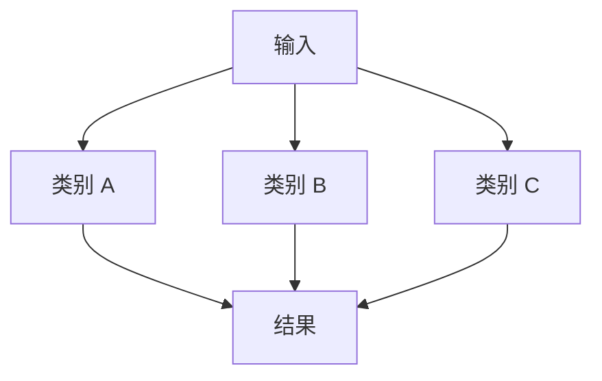

# 手绘流程图样式规范

## 渲染配置

使用支持 `look: "handDrawn"` 的 Mermaid 11 版本渲染 SVG。执行环境应固定 Mermaid 的具体版本，以确保布局和 SVG 结构可复现。以下配置为默认值；可以根据内容调整间距和方向，但不得移除手绘样式、确定性种子或字体栈。

```js
mermaid.initialize({
  startOnLoad: false,
  securityLevel: "strict",
  theme: "base",
  look: "handDrawn",
  handDrawnSeed: 42,
  htmlLabels: false,
  fontFamily: "Excalifont, Xiaolai, cursive",
  themeVariables: {
    fontFamily: "Excalifont, Xiaolai, cursive",
    fontSize: "18px",
    primaryTextColor: "#343a40",
    lineColor: "#495057",
    clusterBkg: "#fffdf7",
    clusterBorder: "#adb5bd",
    actorBkg: "#fff3bf",
    actorBorder: "#d7a33d",
    noteBkgColor: "#ffe8cc",
    noteBorderColor: "#ff922b",
    activationBkgColor: "#d3f9d8",
    activationBorderColor: "#40c057",
    labelBoxBkgColor: "#e5dbff",
    labelBoxBorderColor: "#845ef7"
  },
  flowchart: {
    curve: "basis",
    nodeSpacing: 52,
    rankSpacing: 62,
    padding: 18
  },
  sequence: {
    diagramMarginX: 42,
    diagramMarginY: 28,
    actorMargin: 72,
    messageMargin: 48,
    mirrorActors: false
  }
});
```

仅当可信内容确实需要 HTML 标签或交互功能时，才允许调整 `securityLevel` 或 `htmlLabels`。不得为普通文本标签启用宽松安全模式。

将 SVG 画布背景设置为 `#fffdf7`。最终文件必须直接序列化 `mermaid.render` 的 SVG 输出，不得使用截图或其他位图替代。

## 颜色规则

颜色用于区分语义角色，不用于装饰性随机分配。已有图形或原始材料明确指定颜色含义时，应保留其语义映射。

| 填充色 | 边框色 | 默认语义 |
| --- | --- | --- |
| `#fff3bf` | `#e6b800` | 输入、数据源、准备阶段 |
| `#d0ebff` | `#339af0` | 转换、解析 |
| `#d3f9d8` | `#40c057` | 成功、完成、汇总 |
| `#e5dbff` | `#845ef7` | 编排、调度 |
| `#ffe8cc` | `#ff922b` | 算法、处理过程 |
| `#ffe3e3` | `#fa5252` | 风险、拒绝、冲突 |
| `#c5f6fa` | `#15aabf` | 外部系统、辅助路径 |

通过 Mermaid `classDef` 和节点 class 表达颜色语义。不得依据 SVG 子路径的位置或顺序修改颜色；此类结构不属于稳定接口，可能随 Mermaid 版本或节点形状变化。

同一图中需要区分多个阶段或并行类别时，可以轮换柔和颜色，但相同语义必须保持相同颜色。正文文字统一使用 `#343a40`，连接线统一使用 `#495057`，除非原图已有明确语义约定。

## 布局规则

### 方向选择

- 主要表达阶段推进或层级关系时，优先使用 `TB`。
- 主要表达连续处理链或横向阅读内容时，优先使用 `LR`。
- 消息先后关系使用时序图；合法状态转换使用状态图。
- 不得仅为统一视觉样式而改变图形类型。

### 并行关系

当原始材料明确包含独立分支时，采用扇出和扇入结构：



并行节点应位于同一层级。布局拥挤时，依次采用以下调整方式：缩短标签、增加节点间距、调整图形方向、改用 ELK 布局、拆分为总览图和细节图。不得优先缩小字体或删除关系。

## 字体与可移植性

优先使用 `@excalidraw/excalidraw` 提供的 Excalifont 和 Xiaolai WOFF2 字体。调用 `mermaid.render` 前等待字体加载完成：

```js
await document.fonts.load('18px "Excalifont"');
await document.fonts.load('18px "Xiaolai"');
await document.fonts.ready;
```

独立分发或需要跨环境一致显示时，将实际使用的字体分片及其 `@font-face` 规则写入 SVG 的 `<style>` 元素。嵌入后的 SVG 不得引用远程字体、脚本或其他网络资源。

## SVG 要求

- 设置有效的 `viewBox` 和暖白色背景，不依赖固定像素尺寸完成缩放。
- 添加描述图形用途的 `<title>` 和 `<desc>`，并设置适当的可访问性属性。
- 保持 Mermaid 源码与 SVG 的节点、关系、标签和方向一致。
- 保留稳定的文件名和相对引用路径，避免在文档移动后产生失效引用。

## 验收

替换现有图形前完成以下检查：

- SVG 可以解析，且不包含脚本、远程资源或非预期的交互链接。
- `look: handDrawn` 已生成手绘轮廓；固定输入重复渲染时布局保持一致。
- 中英文并存时，字体声明同时包含 Excalifont 和 Xiaolai；实际显示不存在系统默认字体意外替代。
- 所有标签均位于 `viewBox` 内，没有裁切、重叠或不可辨识的缩放。
- 箭头连接目标正确，分支、循环、并行和汇聚关系不存在歧义。
- 语义颜色保持一致，文字与背景具有足够对比度。
- Markdown 或 Obsidian 引用可以解析到新 SVG，且文档中不存在重复或失效的旧引用。
